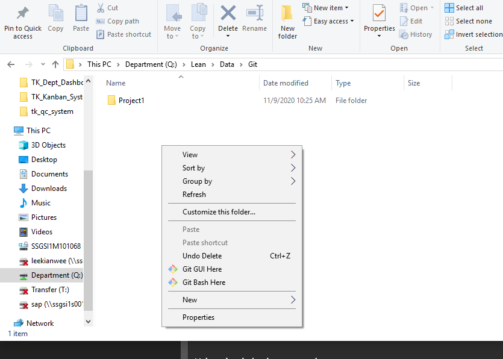
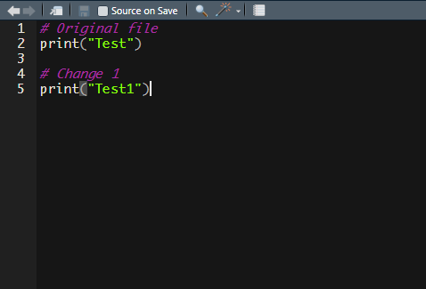
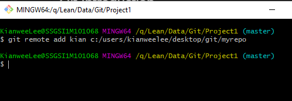
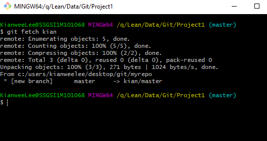
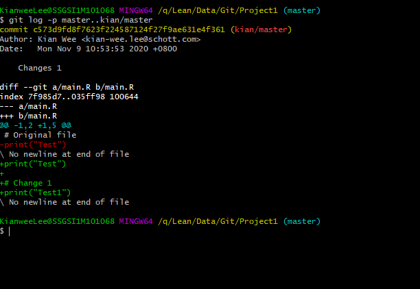
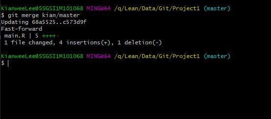

# Introduction to Git

For this example, we will be using 2 types of directories: 

-   Admin's directory (Main directory where we run all our applications in our server)
-   Our own directory

## Step 1: Initialise the working directory (Admin's directory)

-   This is the step needed to tell Git that this is the repo we are working on.
-   To do so admin needs to tell bash to move to that specific directory. This can be done by:

Going into file explorer and enter into the specific directory. Right-click on the folder and click "Git Bash here"


OR

Using simple bash commands:

```bash
cd Q:/Lean/Data/Git/project1
```

-   After all this is done, admin can start the initialisation using:

```bash
git init
```

-   This will create a new directory call .git (hidden)

## Step 2: Take a snapshot of the contents of all files in the current directory

```bash
git add .
```

-   git add will store the changes in a temporary staging area called index.
-   `git add .` will add every file in that directory. If admin wants to add for eg only ui.R, then use `git add ui.R`.

## Step 3: Commit the changes

-   Commit the changes will permanently store the contents of the index in the repository

```bash
git commit
```

A IDE will pop up and you will need to type in the commit message on what you have changed.

## Step 4: Clone the main file to your own directory so that you can make changes without affecting the main file

-   Suppose we want to make changes to the main file in the directory (Q: drive), we will clone the admin's file to our own PC and we name it "myrepo".

```bash
kian$ git clone C:/Lean/Data/Git/project1 myrepo
```

-   After which, we can make the changes we want and commit them. 

```bash
kian$ cd myrepo
kian$ git add .
kian$ git commit -m "Added in new print statement"
```

-   Here, we added a `-m "commit message"` to specify what changes we have made. This message will appear in the history and allow for better tracing.

## Step 5: Before the admin approves the changes made, he or she will view the changes using:

-   The admin will define the remote repository shorthand using:

```bash
git remote add kian c:/users/kianweelee/desktop/git/myrepo
```

-   With the shorthand, the fetching and viewing of changes can be done using:

```bash
git fetch kian
```

```bash
git log -p master..kian/master
```

-   Also, admin can use `gitk head..fetch_head` to view all the histories since they forked.
-   Admin can also use `gitk head...fetch_head` to view both of their histories.

## Step 6: The admin can finally merge the changes if they approve it

```bash
git merge kian/master
```

## Example

### Step 1: We create a folder in q:/Lean/Data/Git call "Project1"


### Step 2: We create an R script inside this Project1 folder

-   Inside the Rscript we can type in anything we want.


-   Here, I type in a comment and a simple print statement and save it as "main.R".

### Step 3: We need to initialise this directory to tell Git that we are going to be working on this directory.

-   We go back to the Git folder, right click on "Project1" and click Git Bash here.
    

-   We then proceed to type in `git init`
    

-   After which, we need to inform Git of the newly created "main.R" file. This is done using `git add .`| Do take note of the period sign at the end.

-   We then do a `git commit -m "Added original file"` to finalise the storage.
    

-   Here, they tell us that we have made 2 changes (2 insertions). These insertion refers to the insert of a comment and a print statement.

### Step 4: Clone this file to our main directory

-   To do this, go to your folder that you will like the file to be stored.
-   In this example, I will store it in my Desktop/Git directory.
-   I will move to C:/Users/kianweelee/Desktop/Git , right-click and click on Git Bash here.
    
-   Here, I will start to clone the file from the Q: drive to my local pc using `git clone q:/Lean/Data/Git/Project1 myrepo`. myrepo will be the name of the file I have cloned. You can name it whatever you want.
    

### Step 5: Make changes to the Rscript

-   Before we make any changes, make sure to `cd myrepo`. This will move us to the newly created directory, myrepo.
    
-   Now we will make changes to the RScript. For this example, we will just add in a comment and another print statement.



-   Back to bash, we need to tell Git about the changes using `git add .` and `git commit -m "Changes 1"`
    

### Step 6: Move back to Q: drive and fetch in the changes

-   Before we fetch in the changes, we need to create a remote shorthand. This remote shorthand allows us to use a single name to replace the directory path. So I can use Kian to replace C:/Users/kianweelee/Desktop/Git/myrepo. I will shoot myself in the head if I have to constantly type the directory pathway.
-   To create the remote shorthand, we can use: `git remote add kian c:/users/kianweelee/desktop/git/myrepo`. If we happen to type anything wrongly and need to remove the remote shorthand, we can use: `git remote rm kian`



-   Now, we can proceed with the fetching using `git fetch kian`
    

-   Next, we want to see what changes are made before doing a final merge. This is done using `git log -p master..kian/master`



### Step 7: Final merge

-   Once we are ok with the changes, we perform the merge. This merge will merge the edits to our main file.
-   To do the merge, we can simply type: `git merge kian/master`
    
-   This should combine the main rscript with the changes.
